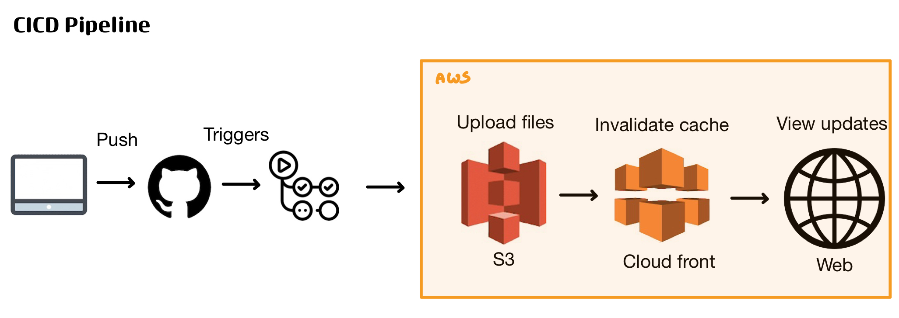
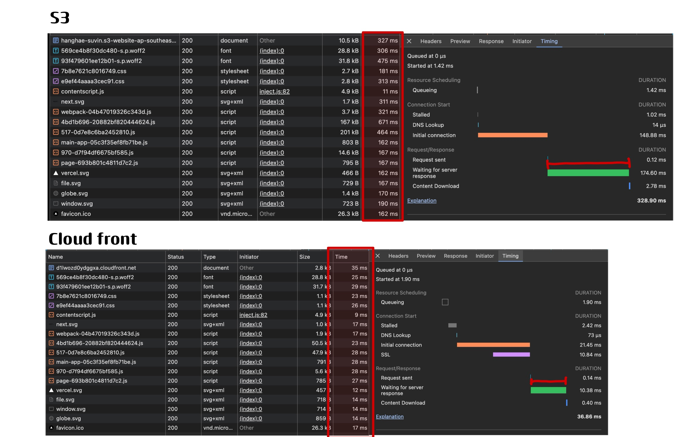

## 성능 개선 보고서

### 프론트엔드 배포 파이프라인

### 주요 링크

- S3 버킷 웹사이트 엔드포인트: <link>http://hanghae-suvin.s3-website-ap-southeast-2.amazonaws.com/</link>
- CloudFrount 배포 도메인 이름: <link>https://d1lwozd0ydggxa.cloudfront.net/</link>

### 주요 개념

GitHub Actions과 CI/CD 도구

- GitHub Actions는 GitHub 저장소에서 코드 변경 사항이 발생할 때 자동으로 빌드, 테스트, 배포 등의 작업을 실행할 수 있도록 도와주는 CI/CD(Continuous Integration/Continuous Deployment) 도구다. 이를 활용하면 Next.js 애플리케이션의 자동 배포 프로세스를 설정할 수 있다.

S3와 스토리지

- Amazon S3(Simple Storage Service)는 정적 웹사이트 호스팅을 지원하는 객체 스토리지 서비스로, Next.js의 정적 파일(HTML, CSS, JavaScript, 이미지 등)을 저장하고 서빙하는 데 사용된다. 단순 S3 배포는 글로벌 성능 최적화가 제한적일 수 있다.

CloudFront와 CDN

- Amazon CloudFront는 AWS의 CDN(Content Delivery Network) 서비스로, S3에 저장된 정적 파일을 전 세계 엣지 로케이션에서 캐싱하여 더 빠르게 제공한다. 이를 활용하면 사용자의 지리적 위치에 따라 성능을 최적화할 수 있다.

캐시 무효화(Cache Invalidation)

- CloudFront는 성능을 높이기 위해 정적 파일을 캐싱하지만, 파일이 변경되었을 때 즉시 반영되지 않을 수 있다. 이를 해결하기 위해 캐시 무효화를 수행하면 특정 경로의 캐싱된 리소스를 제거하고 최신 파일을 가져오도록 할 수 있다.

Repository secret과 환경변수

- GitHub Actions에서 보안이 필요한 정보(AWS Access Key, S3 Bucket Name 등)를 저장하는 방법으로, secrets 기능을 활용하면 민감한 정보를 안전하게 보호할 수 있다. 환경변수는 런타임 시 필요한 설정값을 정의하는 데 사용되며, 배포 환경에 따라 다른 값을 지정할 수 있다.

### s3 / cloudFront 성능 비교

S3 vs CloudFront 성능 비교

1. 첫 번째 요청 시간(Initial Connection & SSL)
   S3 배포: Initial connection이 148.88ms
   CloudFront 배포: Initial connection이 21.45ms, SSL Handshake 포함 10.84ms
   결론: CloudFront가 초기 연결에서 훨씬 빠르며, 글로벌 엣지 로케이션에서 연결을 최적화하여 초기 지연을 줄임.
2. 서버 응답 대기 시간(Waiting for server response)
   S3 배포: 174.60ms
   CloudFront 배포: 10.38ms
   결론: CloudFront가 응답 시간을 16배 이상 빠르게 최적화. 캐싱된 콘텐츠가 근접한 CDN 엣지에서 제공되므로 지연 시간이 감소함.
3. 전체 페이지 로딩 시간(Total Duration)
   S3 배포: 328.90ms
   CloudFront 배포: 36.86ms
   결론: CloudFront는 S3보다 약 9배 빠른 로딩 속도를 제공.
4. 파일 요청 및 다운로드 시간
   S3 배포: 개별 파일의 다운로드 시간이 100ms~700ms
   CloudFront 배포: 개별 파일 다운로드가 10ms~30ms 수준
   결론: CDN을 사용하면 정적 리소스가 지역별 엣지에서 제공되므로 성능 향상됨.

| 항목                        | S3 배포 (ms) | CloudFront 배포 (ms) | 개선율 (%) |
| --------------------------- | ------------ | -------------------- | ---------- |
| Initial Connection          | 148.88       | 21.45                | 85.59      |
| Waiting for Server Response | 174.60       | 10.38                | 94.05      |
| Total Duration              | 328.90       | 36.86                | 88.79      |
